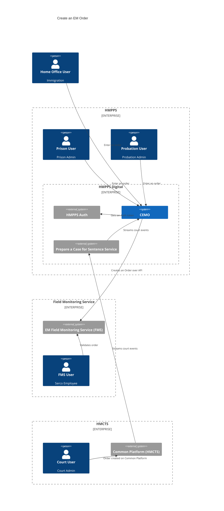
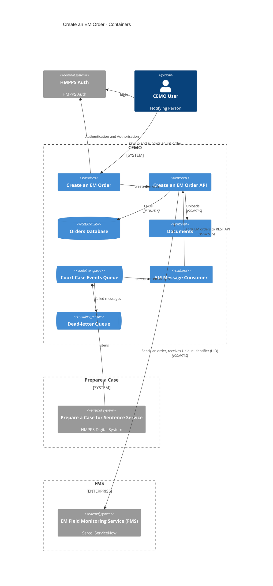

# hmpps-electronic-monitoring-create-an-order <!-- omit in toc -->
[](https://operations-engineering-reports.cloud-platform.service.justice.gov.uk/public-github-repositories.html#hmpps-electronic-monitoring-create-an-order "Link to report")
[](https://circleci.com/gh/ministryofjustice/hmpps-electronic-monitoring-create-an-order)

## Contents <!-- omit in toc -->
- [About this project](#about-this-project)
- [Running the app](#running-the-app)
  - [Dependencies](#dependencies)
  - [Running the application locally](#running-the-application-locally)
    - [One-time setup:](#one-time-setup)
    - [Every-time setup:](#every-time-setup)
- [Running both the UI and the API locally](#running-both-the-ui-and-the-api-locally)
- [Code quality checks](#code-quality-checks)
  - [Run linter](#run-linter)
  - [Run tests](#run-tests)
    - [Running integration tests](#running-integration-tests)
    - [Running end-to-end scenarios against the CEMO API](#running-end-to-end-scenarios-against-the-cemo-api)
- [Change log](#change-log)


## About this project
A service to allow users to Create Electronic Monitoring Orders. This Typescript front-end application is the user interface for the [HMPPS Create an Electronic Monitoring Order API](https://github.com/ministryofjustice/hmpps-electronic-monitoring-create-an-order-api).

## Running the app
The easiest way to run the app is to use docker compose to create the service and all dependencies.

`docker compose pull`

`docker compose up`

### Dependencies
The app requires:
* hmpps-auth - for authentication
* redis - session store and token caching

### Running the application locally

#### One-time setup:
- Create a personal client in the development environment of DPS with the roles `ROLE_EM_CEMO__CREATE_ORDER` and `ROLE_EM_CEMO__CREATE_DEVICE_WEARER`.
    - This service uses [HMPPS Auth](https://github.com/ministryofjustice/hmpps-auth) in development when run locally. Accordingly, to access the service locally you must first have a personal client created in the dev environment of DPS with the relevant roles. You’ll use this to log into the service, including locally.
    - To do this, you must submit a personal client request by cloning the [request template](https://dsdmoj.atlassian.net/browse/HAAR-664) and asking for a review on the [HMPPS Auth and Audit slack channel](https://moj.enterprise.slack.com/archives/C02S71KUBED).
- Create a .env file in the root level of the repository with the following contents. Replace the Client IDs and Client Secrets with values from Kubernetes secrets.

```
PORT=3000
HMPPS_AUTH_URL=https://sign-in-dev.hmpps.service.justice.gov.uk/auth
HMPPS_AUTH_EXTERNAL_URL=https://sign-in-dev.hmpps.service.justice.gov.uk/auth
TOKEN_VERIFICATION_API_URL=https://token-verification-api-dev.prison.service.justice.gov.uk
REDIS_ENABLED=false
NODE_ENV=development
TOKEN_VERIFICATION_ENABLED=true
API_CLIENT_ID=[REPLACE WITH API_CLIENT_ID]
API_CLIENT_SECRET=[REPLACE WITH API_CLIENT_SECRET]
SYSTEM_CLIENT_ID=[REPLACE WITH SYSTEM_CLIENT_ID]
SYSTEM_CLIENT_SECRET=[REPLACE WITH SYSTEM_CLIENT_SECRET]
ENVIRONMENT_NAME=DEV
CEMO_API_URL=http://localhost:8080
```
- Use the command `env` to check that the environment variables are in your current shell session. If any of them aren't listed, then load the environment variables into your current shell session using `export $(cat .env)`
- Install dependencies using `npm install`, ensuring you are using `node v20`
  - Note: Using `nvm` (or [fnm](https://github.com/Schniz/fnm)), run `nvm install --latest-npm` within the repository folder to use the correct version of node, and the latest version of npm. This matches the `engines` config in `package.json` and the CircleCI build config.

#### Every-time setup:

1. To start the main services, excluding the example typescript template app and hmpps auth:

    `docker compose up --scale=app=0 --scale=hmpps-auth=0`

2.  And then, to build the assets and start the app with esbuild:

    `npm run start:dev`

3.  Access the service via [http://localhost:3000](http://localhost:3000), using your dev environment DPS personal credentials to sign in at the sign in page.

## Running both the UI and the API locally
Instructions for this can be found in the readme of the [Create an EM Order API repo](https://github.com/ministryofjustice/hmpps-electronic-monitoring-create-an-order-api).

## Code quality checks

### Run linter

`npm run lint`

### Run tests

`npm run test`

#### Running integration tests

1. For local running, start a test db and wiremock instance by:

    `docker compose -f docker-compose-test.yml up`

2. Then run the server in test mode by:

    `npm run start-feature` (or `npm run start-feature:dev` to run with auto-restart on changes)

3. And then either:
   - run tests in headless mode with `npm run int-test`
   - Or run tests with the cypress UI `npm run int-test-ui`

    Integration tests can be found in the E2E directory in the Cypress UI.

    Note that the scenario tests will fail. To run the scenario tests see the section below, ["Running end-to-end scenarios"](#running-end-to-end-scenarios-against-the-cemo-api).

#### Running end-to-end scenarios against the CEMO API running in Docker

1. Pull the latest Docker images:

    `docker compose -f docker-compose-scenarios.yml pull`

2. For local running, start an API, test db and wiremock instance by:

    `docker compose -f docker-compose-scenarios.yml up`

3. Then run the server so that it can connect to the services in the docker network:

    `npm run start-scenarios` (or `npm run start-scenarios:dev` to run with auto-restart on changes)

4. And then either:
   - run scenario tests in headless mode with `npm run int-test-scenarios`
   - Or run tests with the cypress UI `npm run int-test-ui`

    Scenario tests can be found in the Scenarios directory in the Cypress UI, or you can search for `CEMO0`.

    Note that integration tests will fail. To run the integration tests see the section above, ["Running integration tests"](#running-integration-tests).

#### Running end-to-end scenarios against the CEMO API running locally

1. For local running, start test db and wiremock instance by:

    `docker compose -f docker-compose-scenarios.yml up --scale cemo-api=0`

2. Configure the local API for scenario testing.
- Populate the environemnt variuables file (eg. .env) with the following values:

    ```shell
    HMPPS_AUTH_URL=http://localhost:9091/auth
    DB_SERVER=localhost:5432
    DB_NAME=postgres
    DB_USER=postgres
    DB_PASS=postgres
    DOCUMENT_MANAGEMENT_URL=http://localhost:9091/hmpps/
    SERCO_AUTH_URL=http://localhost:9091/auth/oauth/token
    SERCO_CLIENT_ID=
    SERCO_CLIENT_SECRET=
    SERCO_USERNAME=
    SERCO_PASSWORD=
    SERCO_URL=http://localhost:9091/fms
    CP_PROCESSING_ENABLED=false
    CP_FMS_INTEGRATION_ENABLED=false
    CEMO_FMS_INTEGRATION_ENABLED=true
    HMPPS_S3_BUCKETNAME=test_bucket
    ``` 
- Run the API in intelliJ IDEA in debug mode (this allows you to set breakpoints and debug scenario tests).

3. Run the UI server so that it can connect to the services in the docker & host network:

    `npm run start-scenarios` (or `npm run start-scenarios:dev` to run with auto-restart on changes)

4. And then either:
   - run scenario tests in headless mode with `npm run int-test-scenarios`
   - Or run tests with the cypress UI `npm run int-test-ui`

    Scenario tests can be found in the Scenarios directory in the Cypress UI, or you can search for `CEMO0`.

    Note that integration tests will fail. To run the integration tests see the section ["Running integration tests"](#running-integration-tests).

## Change log

A changelog for the service is available [here](./CHANGELOG.md)

## Architecture




