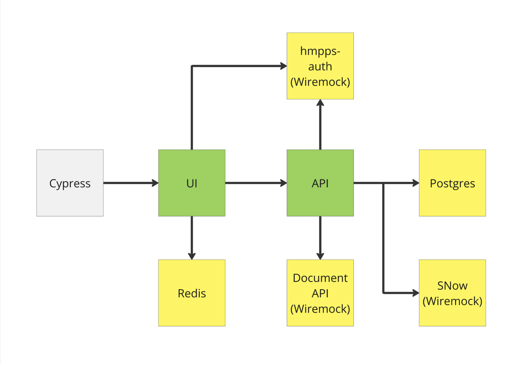

# Scenario Testing

## What is scenario testing?

The scenario test suite is a subset of the Cypress tests defined in this repository. All scenario tests can be found in the `./integration_tests/scenarios` directory.

The scenario tests ensure that realistic Electronic Monitoring Orders can be created by users of the online form. These scenarios were provided by Serco. The tests ensure that the API generates json requests that matches the well known requests generated during end-to-end testing with Serco.

## Environment

The testing environment uses mocked instances of any dependent services; [hmpps-auth](https://github.com/ministryofjustice/hmpps-auth), [hmpps-document-management-api](https://github.com/ministryofjustice/hmpps-document-management-api) and Serco's Service Management System (ServiceNow). Postgres, Redis and the API run as docker containers.



## Running the test suite

First, start all dependent services:

```shell
docker compose -f docker-compose-scenarios.yml up -d
```

To verify that all of the containers are running:

```shell
docker compose -f docker-compose-scenarios.yml ps -a --format json | jq '.[] | { name: .Name , status: .Status}'
```

This should produce an output where all of the containers have a status of "UP" e.g.

```json
{
  "name": "cemo-api",
  "status": "Up About a minute"
}
{
  "name": "cemo-db",
  "status": "Up About a minute (healthy)"
}
{
  "name": "cemo-redis",
  "status": "Up About a minute"
}
{
  "name": "cemo-wiremock",
  "status": "Up About a minute (healthy)"
}
```

Now we can start the application:

```shell
npm run start-scenarios:dev
```

To verify the application has started and is configured correctly:

```shell
curl -s -o /dev/null -w "%{redirect_url}" http://localhost:3007/sign-in
```

If the application is configured correctly, the redirect url should be to the Wiremock container running on port 9091:

```shell
http://localhost:9091/auth/oauth/authorize?response_type=code&redirect_uri=http%3A%2F%2Flocalhost%3A3000%2Fsign-in%2Fcallback&state=jqDWDgdfCwhrBBa0nZUxz11T&client_id=clientid%
```

If the redirect url is anything else, the application is probably picking up environment variables in `.env`. Stop the application and rename this file temporarily to allow the correct configuration to be used.

```shell
mv .env local.env
```

Now that the application is running, in a new terminal, start Cypress:

```shell
npm run int-test-scenarios
```

Alternatively, the Cypress user interface can be used:

```shell
npm run int-test-ui
```
